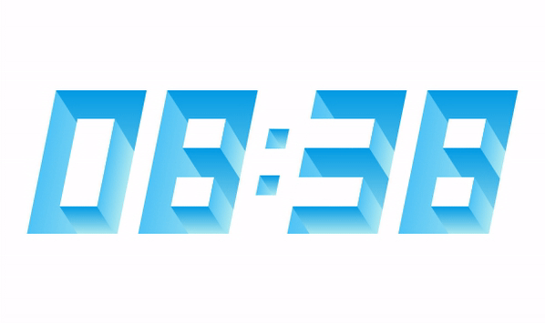
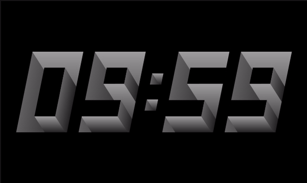

# Iso Clock - Flutter Challenge

This is my take on a classic digital clock look with a modern 3D "flat" design and playful animations. I come from a web background and this is my first Flutter App, so go easy! It has been an absolute delight working with Flutter and I'm excited to encorporate it into future projects. 

**Design Decisions...**
- The Digit faces use color gradients to invoke more playful depth
- I kept this clock a clock, weather and dates on screen were visually distracting
- Digits are large and in charge for readability 
- Lay flat diametric digits look super cool, but upright isometric design had better readability
- Dark mode is very dark while keeping enough contrast so light emission is low at night 

**Things I've learned...**
-  dartpad.dev is a-m-a-z-i-n-g for sketch-ups and quick prototyping of ideas 
- `Stack` Class's `Overflow.clip` does not work on transformed children per https://github.com/flutter/flutter/issues/40216-  
-  Running in profile mode on your device with performance monitor is perfect for testing "real-life" app performance quickly
-  Flutter can take a lot you throw at it, so I had to be careful that I used best practices 

**Anti-aliasiang Artifacts Workaround...**
The `ClipRect` Class's anti-aliasing technique causes artifacts on shape's borders with fractional coordinates. This can be seen in this flutter [issue](https://github.com/flutter/flutter/issues/25009). The edges of the digits in my app were experiencing this issue, and it was pertinent to the design that edges were flush and continuous with the backaground. 

To work around this issue, I essentially put a visual band-aid on top of the artifacts by:
- wrap the main Digit face (DigitFacade) with a parent container
- scale down the size of the Digit face so the perimeter does not share sides with parent
- add an inset border overlay on top of the digit facade that covers the artifacts created by the anti-aliasing algorithm
